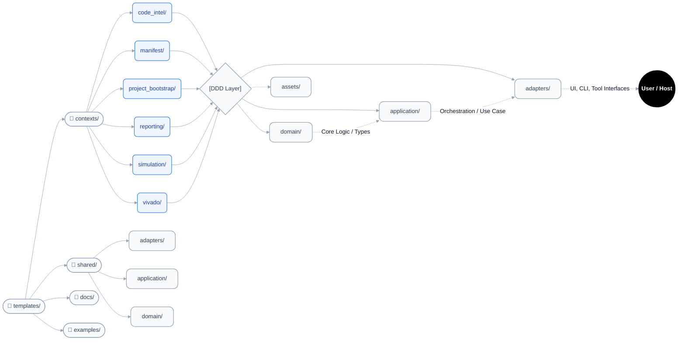
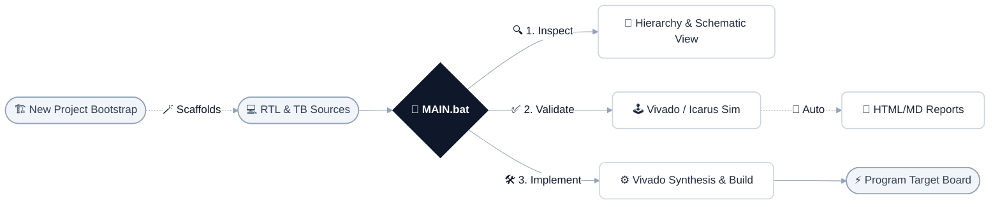
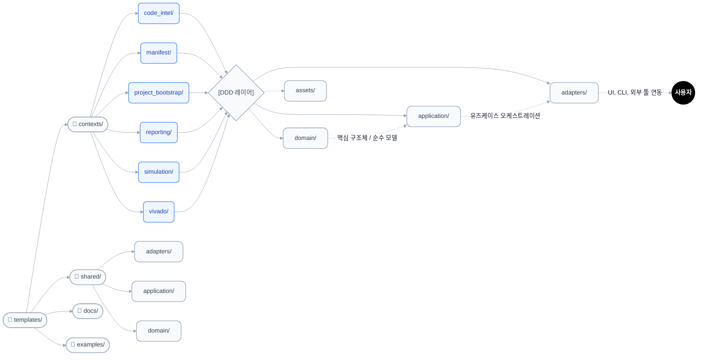

# FPGA Automation Toolkit

<div align="center">


**Batch-based Automation Toolkit for Verilog/SystemVerilog Development**

[English Version](#english-version) | [한국어 버전 (Korean Version)](#korean-version)

</div>

---

<div id="english-version"></div>

## English Version

### 🚀 Overview
The **FPGA Automation Toolkit** is a powerful batch-script automation framework designed to streamline and standardize Verilog and SystemVerilog FPGA workflows on Windows. Rather than manually clicking through GUI applications or writing repetitive scripts for every project, this toolkit provides a unified, menu-driven interface (`MAIN.bat`) to handle simulation, synthesis, build processes, hierarchy analysis, schematic generation, and documentation generation.

By relying on domain-driven design (DDD) principles for its script organization, the toolkit offers a clean separation between application adapters, domain services, and configuration. Projects managed under this toolkit inherently adopt a scalable, consistent layout.

### 🏗️ Directory Architecture

The repository features a highly modular structure based on Domain-Driven Design (DDD) principles.



- **`MAIN.bat`**: The primary menu-driven launcher for the entire toolkit.
- **`Project/`**: The default directory containing individual FPGA projects (discovered automatically if they include valid manifests).
- **`templates/`**: Contains all shared scripts, tools, and configurations that power the toolkit.
  - **`templates/contexts/`**: Contains the core logic scripts organized logically into specific bounded contexts:
    - 🔍 `code_intel/`: Scripts for parsing RTL, building hierarchy trees, and generating schematics.
    - 📦 `manifest/`: Handles YAML manifest parsing and project filelist generation.
    - 🏗️ `project_bootstrap/`: Scripts for scaffolding new projects or migrating legacy ones.
    - 📄 `reporting/`: Adapters for generating HTML/Markdown reports from Vivado logs and source code.
    - 🧪 `simulation/`: Wrapper scripts around Vivado Simulator (xsim) and Icarus Verilog.
    - 🛠️ `vivado/`: Scripts for Vivado synthesis, implementation, and bitstream generation.
    
    *Inside each bounded context, the architecture strictly follows the DDD sub-folder pattern demonstrated in the diagram above:*
    - `adapters/`: Interfaces with the outside world (executable `.bat`/`.sh`, `.js`/`.py` CLI wrappers, Vivado TCL scripts).
    - `application/`: Orchestrates the domain logic to fulfill specific use cases.
    - `domain/`: Pure business logic, strict type definitions, and pure parsing models isolated from I/O.
    - `assets/`: Static files or templates exclusively required by this specific context.

  - **`templates/shared/`**: Shared infrastructure scripts and utilities reusable across different domains.
  - **`templates/docs/`**: Contains core architectural documentation and support matrices.
  - **`templates/examples/`**: Reference boilerplate and SV regression projects for testing toolkit capabilities.

### ⚙️ Prerequisites
To fully utilize the FPGA Automation Toolkit, ensure the following are installed and added to your system `PATH`:

**Required Tools:**
- **Xilinx Vivado**: For simulation, synthesis, and implementation.  
  Vivado installation is intentionally manual (license/policy dependent). The setup script only validates and links PATH.
- **Node.js (and npm)**: For executing JavaScript-based AST parsing and report generation.
- **Python 3**: For executing Python-based scripting and automation elements.

**Optional (but highly recommended):**
- **Yosys** (or `yowasp-yosys`): For hardware schematic visualization and diagram generation.
- **Visual Studio Build Tools (C++ workload)**: Required for compiling native dependencies for the robust AST parser (like `tree-sitter`).

### 🛠️ Quick Start & Installation

1. **Run One-Time Toolkit Bootstrap (Recommended):**
   Run the one-time setup script from repository root:
   ```cmd
   setup_toolkit.bat --yes
   ```
   This prepares Node.js/npm, Python 3.13, Icarus Verilog, Python packages (`jinja2`, `yowasp-yosys`), and runs `templates\\npm install`.  
   Vivado remains manual. If Vivado is already installed, you can register the path with:
   ```cmd
   setup_toolkit.bat --yes --vivado-bin "C:\Xilinx\Vivado\2024.1\bin"
   ```

2. **Run the Toolkit:**
   Simply double-click or run `MAIN.bat` from your command prompt. It will automatically detect valid projects inside the `Project/` directory (those containing an `fpga_auto.yml` manifest file) and provide an interactive terminal menu mapping out all available automation tasks.

3. *(Optional)* **Legacy Project Migration**:
   To migrate root-level legacy projects into the structured `Project/*` format, you can run the bootstrap script:
   ```cmd
   templates\contexts\project_bootstrap\adapters\bat\project_migrate_legacy.bat
   ```

4. *(Optional)* **Manual Dependency Install**:
   If `winget` is unavailable in your environment, install tools manually and then run:
   ```cmd
   cd templates
   npm install
   ```

### 💻 Core Workflows

The toolkit provides several primary workflows out of the box, seamlessly tying tools together:



#### 🤖 [ Telegram Bot Automation ]

- **Launch Telegram Bot** (`Telegram\telegram_fpga_bot_run.bat`)
  - Starts a Telegram bot interface to control the FPGA Automation Toolkit remotely via chat commands.
  - Features include: structured project hierarchy browsing, GUI/NO-GUI Vivado simulations, automated SVG waveform generation, and result presentation.
  - **Architecture Note**: The bot's data structures and application flow have been thoroughly refactored using Domain-Driven Design (DDD) principles for optimal stability and scalability.

#### 🏗️ [ Project Bootstrap / Management ]

1. **Create New Project** (`contexts\project_bootstrap\adapters\bat\project_create.bat`)
   - Scaffolds a new FPGA project directory structure complete with a valid `fpga_auto.yml` manifest.
   - **Usage**: Run the script and enter the new project name when prompted.

#### 🎨 [ Code & Schematic Generation ]

2. **Draw Schematic** (`contexts\code_intel\adapters\bat\code_draw_schematic.bat`)
   - Uses Yosys to parse `.v`/`.sv` modules and outputs SVG logic schematics to `output/Diagram/`.
   - **Usage**: Select the target project and the top module from the interactive menu.

3. **Browse HDL Hierarchy** (`contexts\code_intel\adapters\bat\code_browse_hierarchy.bat`)
   - Explores design structure natively in the terminal. Use `--include-tb` to inspect testbench dependencies.
   - **Usage**: Choose the project and entry file. The hierarchy tree will be printed directly to the console.

4. **Draw FSM** (`contexts\code_intel\adapters\bat\code_draw_fsm.bat`)
   - Automatically extracts Finite State Machine logic and visualizes state transition diagrams.
   - **Usage**: Run the script and select the module containing your FSM logic.

5. **Generate Presentation** (`contexts\reporting\adapters\bat\report_generate_presentation.bat`)
   - Generates a single HTML presentation from module metadata, TB scaffold files, and report artifacts.
   - **Usage**: Runs with project context and emits `Presentation\presentation_<project>_<timestamp>.html`.
   - **Preview**: Open the latest generated HTML through `MAIN.bat -> 18. Open Latest Presentation HTML` (`contexts\reporting\adapters\bat\report_open_latest_presentation_html.bat`).

#### 🕹️ [ Simulation ]

6. **Run Vivado Simulation** (`contexts\simulation\adapters\bat\sim_run_vivado.bat`)
   - Launches Vivado xsim for RTL simulation. After waveform setup is loaded (or initialized), it automatically executes `restart` and `run all`.
   - **Usage**: Select your project and testbench file. This remains the manual GUI path for waveform inspection.

19. **Create DUT TB Scaffold** (`contexts\simulation\adapters\bat\sim_create_dut_tb_scaffold.bat`)
   - Scaffolds a foundational SystemVerilog testbench layout for a specified Design Under Test (DUT).
   - **Usage**: Select the target DUT module, and a boilerplate `.sv` testbench will be generated in your `tb/` folder.

20. **NO GUI Run Vivado Simulation** (`contexts\simulation\adapters\bat\sim_run_vivado_nogui.bat`)
   - Runs the same Vivado replay flow in batch mode without opening the GUI, then stores the selected TB log/journal in the intended TB folder.
   - **Usage**: Select the TB folder and TB file. The script executes `restart` + `run all` silently and updates `output/run_summary.json`.

7. **Auto Sim + Report** (`contexts\simulation\adapters\bat\sim_run_auto_report.bat`)
   - Fully automated validation loop: runs simulation silently and passes VCD/logs directly to the report generator.
   - **Usage**: Choose the project and TB. Wait for the background process to finish and check the `output/` folder.

8. **Run Iverilog VCD (Select TB)** (`contexts\simulation\adapters\bat\sim_run_iverilog_vcd.bat`)
   - Lightweight simulation using open-source Icarus Verilog, outputting VCD waveforms.
   - **Usage**: Select the project and TB. A VCD file will be instantly dumped to the `output/` directory.

9. **Generate SVG from VCD (Select)** (`contexts\simulation\adapters\bat\sim_convert_vcd_svg.bat`)
   - Converts targeted chunks of a `.vcd` waveform trace into scalable vector graphics (`.svg`).
   - **Usage**: Select the valid VCD file and configure the cycle segment you want to render.

10. **Generate WaveDrom from VCD (Select)** (`contexts\simulation\adapters\bat\sim_convert_vcd_wavedrom.bat`)
    - Extracts waveform signals into WaveDrom JSON format for text-based diagram rendering.
    - **Usage**: Select the VCD file; the extracted WaveDrom JSON will map to your `output/` folder.

#### 📄 [ Report (Vivado HTML / Docs) ]

11. **Report Generator** (`contexts\reporting\adapters\bat\report_generate_legacy_html.bat`)
    - Consolidates complex Vivado synthesis/implementation logs into a readable HTML digest.
    - **Usage**: Run post-build to aggregate the `.log` and `.rpt` files into the `output/FINALReport/` directory.

12. **Docs Generator** (`contexts\reporting\adapters\bat\report_generate_docs.bat`)
    - Parses source module declarations (`.v`, `.sv`) into unified markdown/HTML manual structures.
    - **Usage**: Run at any time to generate updated Markdown and HTML documentation from your code comments.

#### 🚀 [ Vivado Flow & FPGA ]

13. **Launch Vivado IPI GUI** (`contexts\vivado\adapters\bat\vivado_launch_ipi_gui.bat`)
    - Opens the current Vivado project in GUI mode for manual verification and block design editing.
    - **Usage**: Select your project to launch the full `.xpr` Vivado workspace.

14. **Run Vivado Build Flow** (`contexts\vivado\adapters\bat\vivado_run_build_flow.bat`)
    - A CLI pipeline that performs Vivado synthesis and implementation processing silently.
    - **Usage**: Trigger the build and monitor the terminal. It completes the workflow up to bitstream generation.

15. **Finalize Block Design** (`contexts\vivado\adapters\bat\vivado_finalize_block_design.bat`)
    - Validates block design connections and regenerates BD wrapper structures.
    - **Usage**: Useful if manually editing BDs outside Vivado to force strict wrapper updates.

16. **Retarget IP to Part** (`contexts\vivado\adapters\bat\vivado_retarget_ip_part.bat`)
    - Aligns and upgrades custom IP specifications with connection to a new target FPGA part number.
    - **Usage**: Execute to bulk-update missing IP references when changing the target FPGA board.

17. **Program FPGA Device** (`contexts\vivado\adapters\bat\vivado_program_fpga.bat`)
    - Scans for a connected JTAG device and flashes the constructed `.bit` bitstream file directly to the board.
    - **Usage**: Connect your board via USB/JTAG and run this to deploy immediately.

18. **Auto Build + Program** (`contexts\vivado\adapters\bat\vivado_run_build_and_program.bat`)
    - Endless execution: Runs the full build flow chain (Synthesis -> Impl) and automatically programs the target right after completion.
    - **Usage**: Connect the board and select the project. The ultimate one-click testing sequence.

### 🧩 SystemVerilog Capabilities
The toolkit provides extensive capabilities around the SystemVerilog (SV) standard, offering both heuristic parsing and rigorous AST tracking using `tree-sitter`.
*For the latest exact status, see `templates/docs/architecture/systemverilog_support_matrix.md`.*

* **Intelligent Hierarchy Parsing**: The analysis backend seamlessly scans `module`, `program`, `interface`, `class`, `checker`, and `package` declarations, mapping them properly without misidentifying keywords like `automatic` or `static`.
* **Flexible Testbench Handling**: Easily inspects complex Simulation TB hierarchies mapping dependencies correctly against RTL blocks.
* **Resilient Auto-Documentation**: The docs generator actively parses `.sv` extensions, bridging modules and producing `report.md/html`.
* **AST Strict Gates**: The canonical indexing backend optionally falls back from `tree-sitter` strict AST mode to a heuristic Regex parser if the native binary dependencies aren't compiled for your local architecture.
* *Note on general limits*: Advanced OOP testbenches should lean heavily on Vivado Simulation routes rather than Icarus Verilog (`iverilog`), which limits `class` and `mailbox` feature sets.

### 📁 Individual Project Structure
When projects are managed successfully by the toolkit, they follow this strictly defined layout:

```text
Project/
`-- [ProjectName]/
    |-- fpga_auto.yml             # Critical toolkit manifest file
    |-- src/                      # Your RTL design sources (.v, .sv)
    |-- tb/                       # Testbenches and simulation infrastructure
    |-- constrs/                  # Constraint files (e.g., .xdc)
    |-- ip/                       # External IP cores
    |-- output/                   # Build and report artifacts
    |   |-- docs/                 # Auto-generated report.md / html / docx
    |   |-- Diagram/              # Graphical schematics
    |   `-- FINALReport/          # Detailed Vivado synthesis/timing reports
    |-- log/                      # Vivado journals and helper logs
    |-- vivado_project/           # The active Vivado GUI/Simulation workspace
    `-- Presentation/             # Reference materials for the project
```

### ❓ Troubleshooting
- **`netlistsvg not found`**: Ensure you have successfully run `npm install` inside the `templates/` folder.
- **Presentation generation failed**: verify Python and Jinja2 are available (`python -m pip install jinja2`).
- **Cannot open latest presentation**: use `MAIN.bat -> 18. Open Latest Presentation HTML` after generation.
- **`vivado not found`** or **`yosys not found`**: Make sure the binary paths for these applications are explicitly added to your system's Environment Variables (`PATH`).
- **Missing File errors during sim**: Verify that the project correctly contains the `fpga_auto.yml` structure.
- **Setup script failed**: Check setup logs under `templates\output\setup\toolkit_setup_*.log`.
- **Need to rollback PATH**: Run `%USERPROFILE%\.fpga_toolkit\backups\restore_user_path_*.bat`.

---

<div id="korean-version"></div>

## 한국어 버전 (Korean Version)

### 🚀 개요
**FPGA 자동화 툴킷(FPGA Automation Toolkit)**은 Windows 환경에서 Verilog 및 SystemVerilog FPGA 워크플로우를 간소화하고 표준화하기 위해 설계된 강력한 배치 스크립트 기반의 자동화 프레임워크입니다. 매 프로젝트마다 GUI 환경을 직접 클릭하거나 반복되는 스크립트를 수동으로 작성하는 대신, 이 툴킷은 하나의 통합 메뉴(`MAIN.bat`)를 통해 시뮬레이션, 합성, 빌드, 계층 구조(Hierarchy) 분석, 회로도(Schematic) 생성 및 문서 자동화 기능을 일괄적으로 제공합니다.

툴킷의 스크립트들은 도메인 주도 설계(DDD) 원칙을 채택하여 작성되었으며, 애플리케이션 어댑터, 도메인 서비스, 설정(Config) 간의 구분을 명확히 하고 있습니다.

### 🏗️ 디렉토리 파일 구조

저장소는 도메인 주도 설계(DDD) 원칙을 채택하여 코드를 분리하고 높은 수준의 모듈화 아키텍처를 가집니다.



- **`MAIN.bat`**: 가장 상위 메뉴 형태 구성을 보여주는 툴킷 메인 실행(런처) 파일.
- **`Project/`**: 개별 FPGA 프로젝트들이 담기는 기본 디렉토리 공간.
- **`templates/`**: 툴킷을 작동시키는 공용 스크립트, 도구, 설정 파일들이 모여있는 핵심 공간.
  - **`templates/contexts/`**: 주요 로직 스크립트들이 논리적 바운디드 컨텍스트(Bounded Context) 단위로 분할되어 있습니다:
    - 🔍 `code_intel/`: RTL 구문 파싱, 계층 트리 생성, 회로도 렌더링 스크립트.
    - 📦 `manifest/`: YAML 매니페스트 속성 파일 분석 및 파일리스트 생성.
    - 🏗️ `project_bootstrap/`: 신규 프로젝트 스캐폴딩 및 구 프로젝트 구조 통폐합.
    - 📄 `reporting/`: 소스 및 시뮬레이션 로그 기반 HTML/Markdown 문서 자동 생성기.
    - 🧪 `simulation/`: Xilinx Vivado (xsim) 및 Icarus Verilog 기반 시뮬레이션 제어 세트.
    - 🛠️ `vivado/`: 코드 합성, 구현(Implementation), 비트스트림 추출 전용 집합.

    *각 컨텍스트 내부는 도메인 주도 설계(DDD) 패턴을 엄격히 따르는 하위 폴더들로 나뉘어져 파편화를 방지합니다 (위 다이어그램 참조):*
    - `adapters/`: 사용자 직접 실행 파일(`.bat`), CLI 래퍼(`.js`, `.py`), Vivado 외부 툴 확장 스크립트 모음.
    - `application/`: 실제 사용자 시나리오대로 작업을 제어하는 오케스트레이션 서비스들.
    - `domain/`: 파일 시스템이나 툴에 종속되지 않은 핵심 비즈니스 로직(정규식 파서, 타입 모델 등) 모음.
    - `assets/`: 뷰 템플릿과 정적 리소스 파일 보관.

  - **`templates/shared/`**: 영역 간 공용으로 재사용되는 유틸리티 서비스 모음.
  - **`templates/docs/`**: 툴킷 자체 아키텍처 문서 및 SystemVerilog 호환 매트릭스.
  - **`templates/examples/`**: 호환성 검증 및 테스트용 표준 템플릿 프로젝트(레퍼런스).

### ⚙️ 시스템 요구사항
툴킷의 100% 기능을 활용하기 위해서는 하단 소프트웨어의 설치와 시스템 경로(`PATH`) 등록이 필수로 권장됩니다.

**필수 도구:**
- **Xilinx Vivado**: 시뮬레이션, 코드 합성, 하드웨어 빌드 시 사용.  
  Vivado는 라이선스/배포 정책 이슈로 자동 설치 대상이 아니며, 초기 설정 BAT에서는 PATH 연결만 점검/반영합니다.
- **Node.js (+ npm)**: JavaScript 기반의 AST 파싱, 파일 탐색 및 자동 문서 생성을 위해 반드시 필요합니다.
- **Python 3**: 파이썬 기반 스크립팅과 문서 및 보고서 처리를 위해 요구됩니다.

**선택 (하지만 적극 권장):**
- **Yosys** (또는 `yowasp-yosys`): 작성한 RTL 코드를 바탕으로 깔끔한 회로도 및 다이어그램을 자동 생성(SVG)하기 위해 권장됩니다.
- **Visual Studio Build Tools (C++ Workload)**: AST 파서 라이브러리(`tree-sitter`) 등 네이티브 C++ 의존성을 가지는 노드 패키지를 원활히 컴파일하기 위해 필요합니다.

### 🛠️ 시작하기 & 설치

1. **초기 1회 환경 설정 실행 (권장):**
   레포 루트에서 아래 BAT를 1회 실행하세요.
   ```cmd
   setup_toolkit.bat --yes
   ```
   이 스크립트는 Node.js/npm, Python 3.13, Icarus Verilog, Python 패키지(`jinja2`, `yowasp-yosys`), `templates\\npm install`까지 한 번에 준비합니다.  
   Vivado는 수동 설치이며, 설치 후 경로 반영은 다음처럼 실행할 수 있습니다.
   ```cmd
   setup_toolkit.bat --yes --vivado-bin "C:\Xilinx\Vivado\2024.1\bin"
   ```

2. **툴킷 실행:**
   단순히 `MAIN.bat` 파일을 더블 클릭하거나 명령 프롬프트에서 직접 실행하십시오. 스크립트가 `Project/` 내부의 유효한 프로젝트(`fpga_auto.yml` 보유 폴더)를 모두 자동 감지하고, 활용 가능한 인터랙티브 실행 메뉴를 띄워줍니다.

3. *(선택)* **구버전 프로젝트 마이그레이션**:
   기존 루트 경로 등에 무질서하게 배치된 레거시 프로젝트를 표준 `Project/*` 구조로 복사/통합하려면 다음 스크립트를 사용하십시오.
   ```cmd
   templates\contexts\project_bootstrap\adapters\bat\project_migrate_legacy.bat
   ```

4. *(선택)* **수동 설치 모드**:
   사내 정책 등으로 `winget`을 사용할 수 없다면 도구를 수동 설치한 뒤 아래를 실행하세요.
   ```cmd
   cd templates
   npm install
   ```

### 💻 핵심 워크플로우

툴킷에서 기본적으로 제공하는 핵심 워크플로우는 다음과 같으며, 모든 시작은 `MAIN.bat`에서 이루어집니다:


#### 🤖 [ Telegram Bot Automation (텔레그램 봇 자동화) ]

- **Launch Telegram Bot** (`Telegram\telegram_fpga_bot_run.bat`)
  - 원격에서 스마트폰이나 데스크톱 메신저 앱으로 FPGA 자동화 툴킷을 직접 제어하기 위한 텔레그램 챗봇 환경을 시작합니다.
  - 계층 구조(Hierarchy) 탐색, Vivado 시뮬레이션 제어(GUI/NO-GUI), 자동화된 파형 렌더링(SVG), 검증 리포트 전송 등 핵심 기능을 챗봇 명령어로 지원합니다.
  - **아키텍처 정보**: 챗봇의 내부 자료구조 및 애플리케이션 흐름은 안정성과 확장성을 위해 철저하게 도메인 주도 설계(DDD) 기반으로 리팩토링 되었습니다.

#### 🏗️ [ Project Bootstrap / Management (프로젝트 초기화) ]

1. **Create New Project** (`contexts\project_bootstrap\adapters\bat\project_create.bat`)
   - 새 FPGA 프로젝트에 필요한 기본 디렉토리 구조와 `fpga_auto.yml` 필수 매니페스트를 자동으로 생성합니다.
   - **사용 방법**: 스크립트를 실행하고 프롬프트 창에 새로운 프로젝트 이름을 입력합니다.

#### 🎨 [ Code & Schematic Generation (코드 및 시각화 생성) ]

2. **Draw Schematic** (`contexts\code_intel\adapters\bat\code_draw_schematic.bat`)
   - Yosys 파서를 활용하여 `.v` / `.sv` 내부 블록을 스캔하고 벡터(SVG) 회로도로 렌더링하여 `output/Diagram/`에 저장합니다.
   - **사용 방법**: 대화형 메뉴에서 분석할 프로젝트와 최상위(Top) 모듈을 선택합니다.

3. **Browse HDL Hierarchy** (`contexts\code_intel\adapters\bat\code_browse_hierarchy.bat`)
   - 터미널 트리(Tree) 계층도를 출력합니다. `--include-tb` 활성화 시 숨겨진 테스트벤치 참조 파일까지 연결하여 보여줍니다.
   - **사용 방법**: 대상 파일을 선택하면 텍스트 기반의 계층 트리가 즉시 콘솔에 출력됩니다.

4. **Draw FSM** (`contexts\code_intel\adapters\bat\code_draw_fsm.bat`)
   - 소스코드 내 상태머신(FSM) 정의를 추적하여 상태 전이 다이어그램을 렌더링합니다.
   - **사용 방법**: 스크립트를 실행하고 FSM 로직이 포함되어있는 구조 모듈을 선택합니다.

5. **Generate Presentation** (`contexts\reporting\adapters\bat\report_generate_presentation.bat`)
   - 모듈 메타데이터, TB scaffold, 리포트 산출물을 기반으로 단일 HTML 발표자료를 생성합니다.
   - **사용 방법**: 실행 시 `Presentation\\presentation_<project>_<timestamp>.html` 파일을 생성합니다.
   - **미리보기**: `MAIN.bat -> 18. Open Latest Presentation HTML` (`contexts\reporting\adapters\bat\report_open_latest_presentation_html.bat`)로 최신 HTML을 엽니다.

#### 🕹️ [ Simulation (시뮬레이션 구동 및 파형 분석) ]

6. **Run Vivado Simulation** (`contexts\simulation\adapters\bat\sim_run_vivado.bat`)
   - 테스트벤치 선택 후 Vivado xsim GUI를 열고, 웨이브폼 설정 로드(또는 초기화) 직후 자동으로 `restart`와 `run all`을 실행합니다.
   - **사용 방법**: 프로젝트와 TB를 선택하면 파형 창 표시 후 자동 재실행이 1회 수행됩니다. 이 경로는 GUI 수동 확인용으로 유지됩니다.

19. **Create DUT TB Scaffold** (`contexts\simulation\adapters\bat\sim_create_dut_tb_scaffold.bat`)
   - 선택한 대상(DUT, Design Under Test) 모듈의 인터페이스를 분석하여 기본 뼈대를 갖춘 SystemVerilog 테스트벤치(Scaffold) 파일을 자동 생성합니다.
   - **사용 방법**: 대상 DUT 모듈을 선택하면, 시뮬레이션 코드 작성을 바로 시작할 수 있는 최적화된 `.sv` 파일이 `tb/` 폴더 내부에 준비됩니다.

20. **NO GUI Run Vivado Simulation** (`contexts\simulation\adapters\bat\sim_run_vivado_nogui.bat`)
   - GUI 없이 Vivado batch 모드로 동일한 `restart` + `run all` 흐름을 수행하고, 선택한 TB 기준 로그/저널과 `output/run_summary.json`을 갱신합니다.
   - **사용 방법**: TB 폴더와 TB 파일을 고르면 NO GUI 시뮬레이션이 바로 실행되고 결과 로그가 해당 TB 위치에 저장됩니다.

7. **Auto Sim + Report** (`contexts\simulation\adapters\bat\sim_run_auto_report.bat`)
   - 시뮬레이션 직후 추출된 VCD 파형과 검증 로그를 HTML 문서화 프로세스에 자동으로 넘겨 문서 형태로 기록합니다.
   - **사용 방법**: 테스트를 선택하고 기다리기만 하면 됩니다. 완료 후 `output/` 에서 결과를 확인하세요.

8. **Run Iverilog VCD (Select TB)** (`contexts\simulation\adapters\bat\sim_run_iverilog_vcd.bat`)
   - 가벼운 오픈소스 Icarus Verilog 엔진을 통해 컴파일하고 VCD 파형 파일을 즉시 덤프해냅니다.
   - **사용 방법**: 실행할 테스트벤치를 고르면 컴파일 후 VCD 파일 추출까지 한 번에 동작합니다.

9. **Generate SVG from VCD (Select)** (`contexts\simulation\adapters\bat\sim_convert_vcd_svg.bat`)
   - 추출된 거대한 VCD 파형에서 특정 사이클 구간 만을 골라 깔끔한 벡터(SVG) 이미지로 기록/변화시킵니다.
   - **사용 방법**: 생성된 VCD를 고른 다음 추출하고 싶은 구간(사이클, 엣지 등)을 설정합니다.

10. **Generate WaveDrom from VCD (Select)** (`contexts\simulation\adapters\bat\sim_convert_vcd_wavedrom.bat`)
    - 파형 신호를 다이어그램 타이밍 전용 문법인 WaveDrom(JSON) 형태로 파싱해냅니다.
    - **사용 방법**: 파일만 선택하면 WaveDrom 코드로 변환해줍니다. 이를 다이어그램 렌더링에 사용할 수 있습니다.

#### 📄 [ Report (Vivado HTML / Docs 생태계) ]

11. **Report Generator** (`contexts\reporting\adapters\bat\report_generate_legacy_html.bat`)
    - 흩어져있는 Vivado GUI 에러/합성/구현 로그들을 하나로 모아 보기 편한 통합 HTML 리포트로 구워냅니다.
    - **사용 방법**: Vivado 빌드를 한 번 마친 후 실행하여 `output/FINALReport/` 디렉토리에 요약본을 생성합니다.

12. **Docs Generator** (`contexts\reporting\adapters\bat\report_generate_docs.bat`)
    - 전통적 방식의 레거시 모듈 코드 분석기가 각 스크립트를 파싱해 마크다운 및 HTML 명세서를 산출합니다.
    - **사용 방법**: 코딩 및 주석 작성을 마친 후 언제든지 실행하여 API 컴포넌트 백과사전 문서처럼 활용합니다.

#### 🚀 [ Vivado Flow & FPGA (빌드 파이프라인 및 보드 플래싱) ]

13. **Launch Vivado IPI GUI** (`contexts\vivado\adapters\bat\vivado_launch_ipi_gui.bat`)
    - 백그라운드에서 조작하던 Vivado `.xpr` 프로젝트 환경을 화면(그래픽) 상에 띄웁니다.
    - **사용 방법**: 스크립트 실행 후 프로젝트를 선택하면 수동 검증 및 설정을 위한 Vivado 창이 뜹니다.

14. **Run Vivado Build Flow** (`contexts\vivado\adapters\bat\vivado_run_build_flow.bat`)
    - GUI 노출 없이 백그라운드상에서 전체 논리합성(Synthesis)과 구현(Implementation)을 일괄 관통합니다.
    - **사용 방법**: 한 번의 클릭으로 터미널에서 상태를 보며 비트스트림 추출까지 전부 자동으로 처리합니다.

15. **Finalize Block Design** (`contexts\vivado\adapters\bat\vivado_finalize_block_design.bat`)
    - 블록 디자인(BD) 구조를 검증하고 내부 래퍼(Wrapper) 파일을 최신으로 강제 자동화/재계산합니다.
    - **사용 방법**: IP나 블록 디자인을 외부에서 건드렸을 때, 이를 연동시키기 위해서 1회 실행해 줍니다.

16. **Retarget IP to Part** (`contexts\vivado\adapters\bat\vivado_retarget_ip_part.bat`)
    - 프로젝트 타겟 FPGA 부품(Part)이 바뀌었을 경우 관련 IP 코어들을 자동 업그레이드 연동 시킵니다.
    - **사용 방법**: 디바이스 설정이 물리적으로 변경된 후 이 스크립트를 실행하여 파트(Part) 호환성을 강제 일치시킵니다.

17. **Program FPGA Device** (`contexts\vivado\adapters\bat\vivado_program_fpga.bat`)
    - 새로 빌드된 `.bit` 파일을 가져다가 USB/JTAG가 연결된 FPGA 타겟 보드에 다이렉트로 프로그램(굽기) 합니다.
    - **사용 방법**: 실물 보드와 PC를 연결한 후 실행하면 메뉴 화면 없이 곧바로 하드웨어에 동작이 주입(Deploy)됩니다.

18. **Auto Build + Program** (`contexts\vivado\adapters\bat\vivado_run_build_and_program.bat`)
    - 원클릭 시스템: 14번 스크립트 기반 합성과 빌드를 진행한 후 성공 시 자동으로 17번 JTAG 플래시 과정을 이어붙여 수행합니다.
    - **사용 방법**: 보드 연결 및 세팅 후 실행하세요. 개발부터 단말 펌웨어 업데이트까지 논스탑으로 진행되는 마법의 버튼입니다.

### 🧩 SystemVerilog 호환성
본 자동화 툴킷은 SystemVerilog(SV) 표준에 대한 광범위한 기능을 지원하며, 복원력이 높은 휴리스틱 정규식 스크립트와 `tree-sitter`를 이용한 정교한 AST 추적 환경을 동시 제공합니다.
*업데이트 되는 최신 상태 확인: `templates/docs/architecture/systemverilog_support_matrix.md` 참조.*

* **지능적 계층 스캐닝**: 단순한 `module` 선언 뿐만 아니라 `program`, `interface`, `class`, `checker`, `package` 구문을 정확히 파싱하며, SystemVerilog 특유의 `automatic`, `static` 같은 키워드를 오인식 하지 않습니다.
* **테스트벤치 최적화**: RTL 블록과 비교해 더욱 계층과 참조가 복잡한 시뮬레이션용 TB 코드들도 매끄럽게 컴파일 스코프로 포섭합니다.
* **복원형 문서 구조**: `.v` 확장자 뿐만 아니라 최신 툴 체계의 `.sv` 파일들에서도 명세서를 추출, 마크다운 및 HTML 형태(`report.md/html`)로 자동 덤프합니다.
* **AST 모드 자동 Fallback**: 만약 사용자의 로컬 환경에 네이티브 라이브러리(`tree-sitter`)가 준비되어있지 않더라도 멈추지 않고, 내장된 자체 정규식 파서(Heuristic) 모드로 자동 폴백 처리됩니다.
* *(주의)* OOP(객체지향)이 폭넓게 적용된 고급 SystemVerilog 테스트벤치의 시뮬레이션은 Icarus Verilog(`iverilog`) 대신 `vivado_sim` 기반의 워크플로우 노선을 선택하시길 권장합니다.

### 📁 개별 프로젝트 구조
툴킷에 의해 관리되는 각 프로젝트는 모두 공통적으로 다음과 같이 통일된 표준 레이아웃을 가지게 됩니다:

```text
Project/
`-- [Project_Name]/
    |-- fpga_auto.yml             # 필수 매니페스트 파일 (이 파일이 있어야 툴이 감지함)
    |-- src/                      # RTL 원본 소스코드 저장 영역 (.v, .sv)
    |-- tb/                       # 테스트벤치 코드 저장 영역
    |-- constrs/                  # 핀맵 및 타이밍 Constraints 파일 (.xdc)
    |-- ip/                       # Vivado IP 코어 파일 관리
    |-- output/                   # 모든 최종 결과물이 나오는 영역
    |   |-- docs/                 # report.md / html 등 코드를 변환 자동 문서
    |   |-- Diagram/              # 자동 생성 회로도/다이어그램 (SVG)
    |   `-- FINALReport/          # Vivado 합성 및 타이밍 분석 리포트
    |-- log/                      # Vivado 구동 도중 발생하는 스크립트 로그 (에러 디버깅)
    |-- vivado_project/           # 실제 Vivado 프로젝트(.xpr)가 생성 및 구동되는 워크스페이스
    `-- Presentation/             # 프로젝트와 관련된 프레젠테이션, 부가자료 저장
```

### ❓ 문제 해결 (Troubleshooting)
- **`netlistsvg not found` 오류**: 초기 설정 단계인 `templates` 디렉토리 속에서 `npm install` 과정을 실행했는지 확인합니다.
- **발표 생성 실패**: Python/Jinja2 설치 상태를 확인하세요 (`python -m pip install jinja2`).
- **최신 발표자료 열기 실패**: 먼저 발표 생성 후 `MAIN.bat -> 18. Open Latest Presentation HTML`를 사용하세요.
- **`vivado is not recognized...` 혹은 `yosys` 오류**: 해당 소프트웨어들의 실행 경로(`.exe` 나 `bin` 폴더)가 Windows 시스템 환경 변수인 `PATH`에 명시적으로 연결되어 있는지 점검합니다.
- **시뮬레이션에서 파일이 없다는 오류 발생 시**: 대상 프로젝트 폴더 내부에 올바른 모델링 파일 구조와 기준점인 `fpga_auto.yml` 이 존재하는지 확인하세요.
- **초기 설정 BAT 실패 시**: `templates\output\setup\toolkit_setup_*.log` 로그를 확인하세요.
- **PATH 되돌리기 필요 시**: `%USERPROFILE%\.fpga_toolkit\backups\restore_user_path_*.bat`를 실행하세요.
